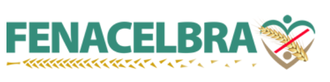

# Grupo 9 - Fenacelbra

|Data|Versão|Descrição|Autor|
|:---|:---|:---|:---|
|06/09/2019|1.0|Criação da Home |Marcos Vinícius|
|06/09/2019|1.0|Edição e adição no Mkdocs |Marcelo Magalhães|

## Sobre a Escolha do Tema

O tema foi decidido após análise do sistema com problemas mais graves.
Outros aplicativos e programas na votação: suap, alura.

## Grupo

O grupo 9 é composto por 6 alunos da disciplina de Interação Humano Computador do 2º Semestre de 2019. Sendo eles:

| Nome | Matrícula | GitHub |
| ------ | ------ | ------- |
| Débora Vilela | 17/0008762| [deborapvilela](https://github.com/deborapvilela) |
| Gabriel Marques Tiveron  | 17/0103471 | [GabrielTiveron](https://github.com/GabrielTiveron)
| Marcelo Ferreira Magalhães Júnior| 19/0047348 | [Marrcelo](https://github.com/Marrcelo)
| Marcos Vinícius Rodrigues da Conceição | 17/0150747 | [marcos-mv](https://github.com/marcos-mv) |
| Nathalia Lorena Cardoso | 14/0156909 | [Natilorens](https://github.com/Natilorens)
| Victor Levi Peixoto| 17/0115208 | [VictorLeviPeixoto](https://github.com/VictorLeviPeixoto) |

## Comunicação

Utilizamos o Telegram como principal meio de contato com os membros do grupo, por meio dele são definidas horários das reuniões presenciais e online, distribuição de tarefas em aberto, avisos, discussões acerca do andamento da disciplina e etc...
As reuniões online são feitas através da plataforma da Google Hangouts.

## Como trabalhamos

O grupo se reuni por Hangouts após as aulas de exposição de conteúdo para discutir sobre a matéria e distribuir as tarefas, e das dinâmicas para melhorar os esboços e produzir a versão final que será entregada na apresentação. As reuniões são marcadas pelo Telegram com auxílio de tabelas de horários construídas no Google Docs.

## Contribuição no Repositório

### Política de _commits_

É recomendado que todo contribuinte do projeto siga as orientações a seguir para realizar _commits_ de forma padronizada:

* Mensagens curtas e significativas sobre o conteúdo do _commit_.

* Apenas _commits_ que adicionem incrementos significativos, ou seja, nada de _commits_ apenas mudando nomes de títulos, por exemplo.

### Política de Branch

Serão utilizadas duas _branchs_:

* **master** - é a _branch_ principal do repositório. Nela só é aceita versões completas dos documentos ex: 1, 2.

* **development** - é a _branch_ que concentrará todas as menores modificações dos documentos que não sejam completas ex: 1.1, 1.2, 2.3.

## Referências

1. Site da Fenacelbra - http://www.fenacelbra.com.br/ acesso em 06/09/2019
